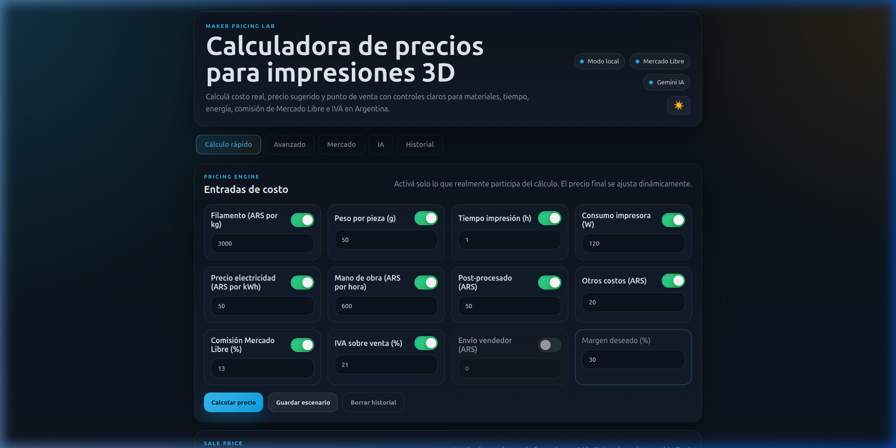
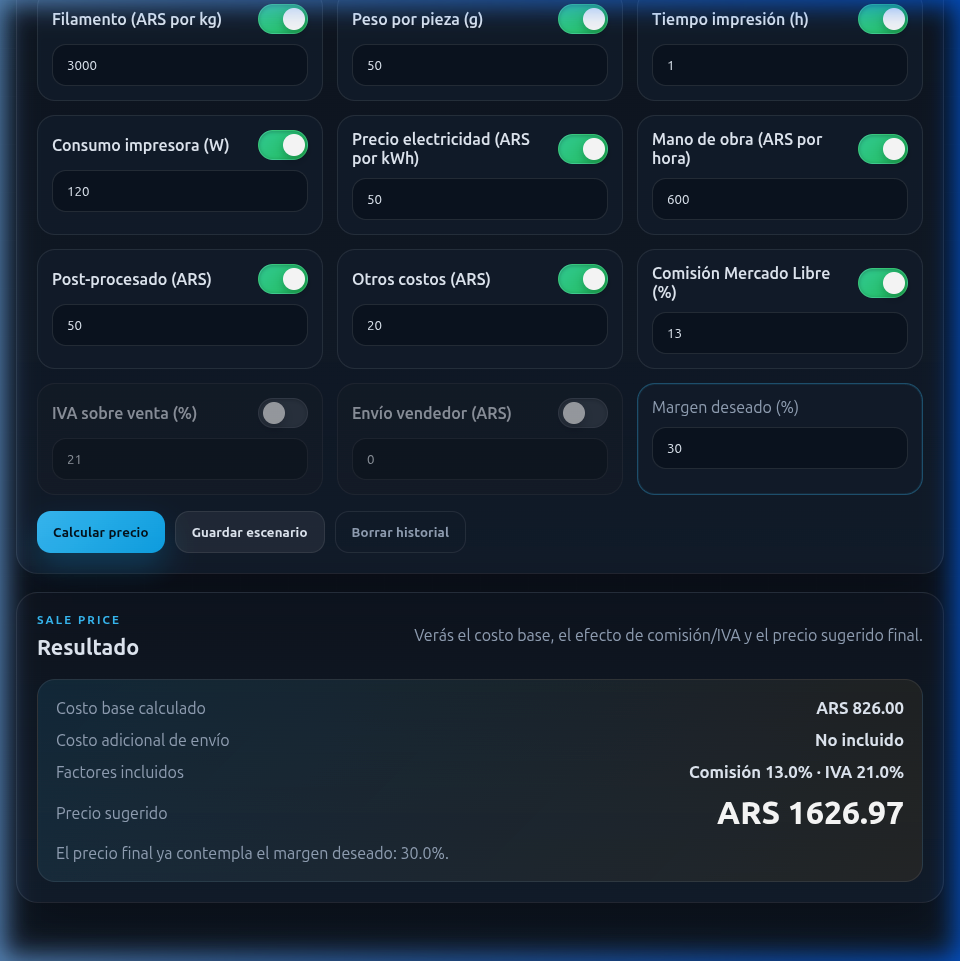
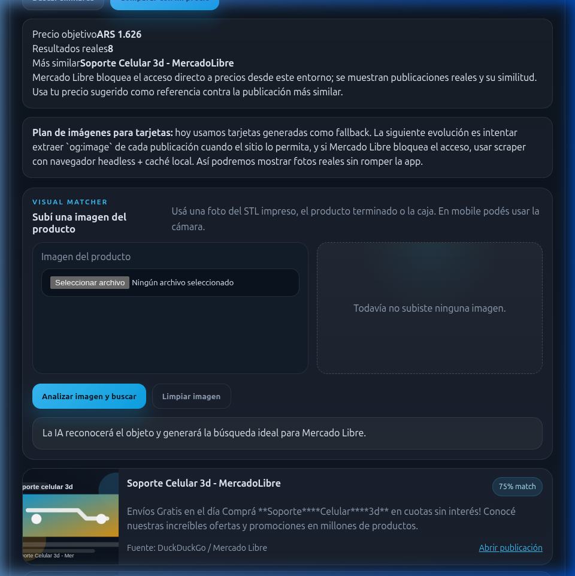
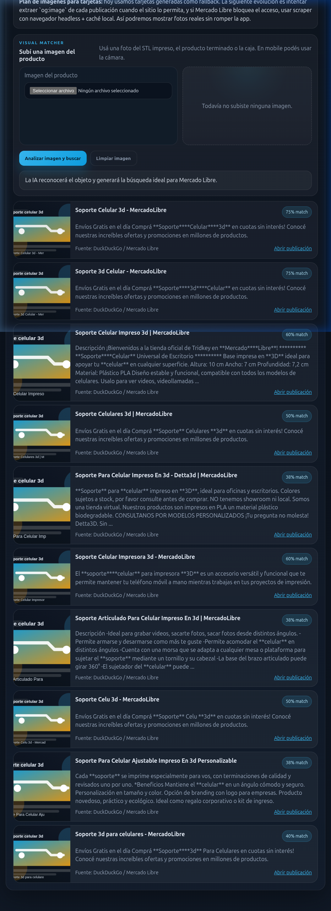
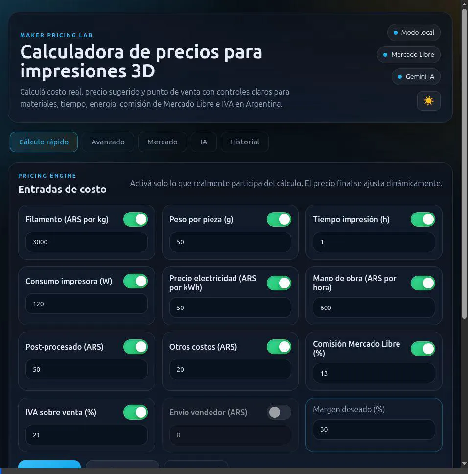

# 🚀 Maker Pricing Lab — Calculadora de Impresión 3D

[](https://nodejs.org)
[](https://expressjs.com)
[](https://deepmind.google/technologies/gemini/)
[](https://localfirstweb.dev/)

Una suite local-first avanzada e inteligente para makers. Permite calcular costos reales de producción, estimar precios de venta sugeridos en Argentina y contrastar tus ideas contra el mercado de Mercado Libre en tiempo real, todo potenciado con inteligencia artificial (Gemini) y análisis visual de piezas.

---

## 📽️ Demostración en Acción

Así funciona el flujo completo de cálculo rápido, testeo de escenarios, pestañas modulares y raspado con comparativa de mercado real:


### 📸 Capturas de Pantalla (Flujo Validado)

| 1. App Inicial (Dark Mode) | 2. Resultado de Cotización | 3. Comparador de Mercado |
| :---: | :---: | :---: |
|  |  |  |

---

## ✨ Características Principales

*   **⚡ Motor de Pricing Dinámico:** Ingresa costos de filamentos, tiempo de impresión, consumo eléctrico de la impresora, tarifa de luz local, mano de obra, post-procesado, comisiones de Mercado Libre e IVA. Todo se calcula en el denominador para darte un precio sugerido exacto de punto de equilibrio.
*   **📂 Historial Local Interactivo:** Guarda tus escenarios de cotización directamente en tu navegador. Exporta todo a formatos estándar de la industria (CSV y JSON) con un solo clic.
*   **🔍 Integración de Mercado Libre:** Búsqueda pública en tiempo real (vía proxy DuckDuckGo y Jina.ai) para comparar tus costos con competidores reales.
*   **🏷️ Extractor de Precios Inteligente:** El backend analiza sintácticamente las publicaciones del mercado y extrae precios aproximados (ej. `ARS 4.500`) de los snippets para compararlos automáticamente con tu precio objetivo.
*   **👁️ Reconocimiento Visual IA:** Sube fotos de tus piezas impresas o diseños STL para que la IA (Gemini 2.5 Flash) reconozca la pieza y genere palabras clave optimizadas para el mercado.
*   **🤖 Copiloto IA Generativo:** Analiza márgenes ideales de venta, redacta títulos atractivos optimizados para SEO y autogenera descripciones completas para tus publicaciones.

---

## 🏗️ Arquitectura Modular (Fase 1)

El proyecto cuenta con un diseño limpio y modular:

```text
├── index.html                   # Interfaz de usuario (UI) principal
├── package.json                 # Scripts y dependencias generales
├── src/
│   ├── styles.css               # Diseño visual (Glassmorphism, Dark/Light Mode)
│   └── js/
│       ├── ui.js                # Controlador principal del DOM y tema
│       ├── calculator.js        # Motor matemático puro de cotizaciones (Testado)
│       ├── history.js           # Gestor de localStorage y exports CSV/JSON
│       └── api.js               # Cliente HTTP de servicios backend
├── server/
│   ├── index.js                 # Servidor Express (API central y estáticos)
│   └── services/
│       ├── mercadolibre.js      # Parser de precios y raspador DuckDuckGo
│       └── gemini.js            # Lógicas de fallback e IA
└── test/
    └── calculator.test.mjs      # Tests unitarios del motor de cálculo
```

---

## 🖼️ Extracción Dinámica y Asíncrona (Fase 2)

La aplicación realiza un flujo asíncrono e inteligente para mostrar la realidad del mercado sin bloquear la experiencia de usuario:
1. **Lazy Loading Escalonado:** Se renderizan primero las tarjetas usando datos de búsqueda preliminares e imágenes generativas SVG. Luego se disparan peticiones escalonadas (1.2s de intervalo) al endpoint `/api/ml/details` del servidor backend para no saturar los límites de peticiones ni bloquear el hilo del navegador.
2. **Resiliencia ante Bloqueos:** El backend consulta vía `Jina.ai` a Mercado Libre y extrae el precio final y la imagen principal (`og:image`). Si detecta un bloqueo de Cloudflare o captcha, responde con estados de fallback controlados permitiendo que la interfaz permanezca funcional con marcadores estéticos.

| Resultados y Lazy Load de la Fase 2 |
| :---: |
|  |

*Flujo animado verificado de carga secuencial de tarjetas en Chrome:*


---

## 🛠️ Cómo Ejecutar el Proyecto

### Opción 1: Aplicación Completa con Backend (Recomendada)
Para habilitar la IA, el visual matcher y el raspado de precios de Mercado Libre, levanta el backend local:

1. Instala las dependencias en la raíz:
   ```bash
   npm install
   ```
2. Ejecuta el servidor de desarrollo:
   ```bash
   npm start
   ```
3. Abre en tu navegador:
   ```text
   http://localhost:3000
   ```

### Opción 2: Frontend Estático (Solo cálculo local)
Si solo deseas usar el cotizador matemático sin integración de red, sirve el frontend estático desde la raíz:
```bash
python3 -m http.server 8000
```
Y abre: `http://localhost:8000`

---

## 🧪 Pruebas Unitarias
El motor matemático cuenta con un set de pruebas robustas integradas al corredor nativo de Node.js (Node 18+):

Para correr los tests ejecuta:
```bash
npm test
```

Valida:
- [x] Cálculos de costo base.
- [x] Aplicación de comisiones e IVA en el denominador para punto de equilibrio.
- [x] Control de error para comisiones acumuladas $\ge 100\%$.

---

## 🔑 Configuración de IA y APIs externas

### 1. Copiloto IA (Local-first)
La aplicación almacena de forma segura tu API Key de Google Gemini en el `localStorage` de tu propio navegador.
1. Ve a la pestaña **IA**.
2. Selecciona **Google Gemini**.
3. Ingresa tu API Key gratuita obtenida en [Google AI Studio](https://aistudio.google.com/).
4. Haz clic en **Guardar clave**.

*Nota: Si no posees clave, la aplicación cuenta con un motor de fallback local inteligente que simulará respuestas de diagnóstico en pesos argentinos.*

### 2. Integración Oficial de Mercado Libre
La aplicación posee soporte completo para interactuar con Mercado Libre Argentina de forma oficial de dos maneras:
- **Opción A: Modo Desarrollador (Client ID + Client Secret):** Los programadores pueden ingresar sus propias credenciales de aplicación creadas en el portal de developers de Mercado Libre. Los tokens de acceso se solicitan bajo demanda (`client_credentials`) y se manejan de forma segura en memoria del servidor.
- **Opción B: Modo Usuario Común (Autenticación OAuth 2.0):** Los usuarios vendedores pueden iniciar sesión de forma segura haciendo clic en **Conectar con Mercado Libre**. Serán redirigidos al portal de inicio de sesión de Mercado Libre para otorgar permisos a la aplicación y retornar con un token de acceso que se almacena en el navegador para autorizar la publicación de sus artículos.

*La configuración se realiza desde la pestaña dedicada **Integraciones**.*

---

## 📈 Publicador Inteligente & Asistente SEO (Fase 2.5)
La app cuenta con un publicador y optimizador comercial integrado en la pestaña **Mercado**:
1. **Carga de Datos:** Importa automáticamente los costos de producción y margen calculados del cotizador.
2. **Generación con IA (Gemini):**
   - **Títulos SEO**: Analiza palabras clave para generar un título comercial adaptado a Mercado Libre limitado estrictamente a 60 caracteres.
   - **Descripciones persuasivas**: Crea fichas de venta técnicas en 500 caracteres, detallando características del material impreso en 3D y llamada a la acción en tono local (Argentina).
3. **Precios Dinámicos:** Calcula y ajusta el precio óptimo a publicar basado en el costo real, comisiones de Mercado Libre, IVA, envío y una estrategia de mercado ajustable (Equilibrada, Agresiva o Premium) frente a competidores en tiempo real.
4. **Publicación Directa:** Permite editar y publicar el producto final en Mercado Libre en un solo clic (requiere autenticación de vendedor).

---

## 🎯 Próximos Desarrollos (Roadmap)
- [x] **Fase 1: Motor Matemático de Precios:** Margen neto, costos fijos y variables.
- [x] **Fase 2: Extracción Real de Precios y Fotos del Mercado:** Integración de búsqueda y comparación de publicaciones reales con metaetiquetas de imágenes.
- [x] **Fase 2.5: Conexión Oficial y Publicador SEO de Mercado Libre:** Integración dual de Mercado Libre API (Opción A/B), optimizador de fichas comerciales con Gemini e inteligencia de precios dinámicos.
- [ ] **Fase 3: Historial Avanzado e Interactivo:** Tarjetas de proyecto interactivas para cargar cotizaciones guardadas nuevamente en la calculadora, eliminar registros individuales e incluir notas y etiquetas personalizadas (ej. "Prototipo", "Cliente VIP").
- [ ] **Fase 4: Biblioteca de Materiales (Pestaña Avanzado):** CRUD local completo de perfiles de filamento (PLA, ABS, PETG, TPU) con costos por kg y densidades asociadas para poblar dinámicamente el selector.
- [ ] **Fase 5: Estimador Automatizado mediante Archivo 3D (STL/3MF):** Análisis local del volumen de archivos STL/3MF para calcular peso de filamento requerido y estimar tiempos de forma automática.

